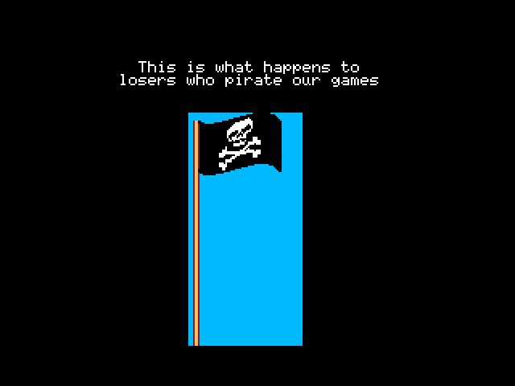

# Anti piracy screen demo
An anti piracy screen demo developed with MSXgl in Screen 5 for MSX2 making use of the VDP command engine, or to be precise HMMM (High speed move from VRAM to VRAM). Unauthorized copying and editing is encouraged

  

That said tho the skull (not the crossbones, just the skull) and some familiar fish were shamelessly pirated from **Eindeloos** and **Commander Keen** respectively. Those **AREN'T** covered by the MIT license and remain subject to the rights of their respective copyright holders. If you're **really _that_ paranoid** then I'd say you should change the graphics and take it out, respectively.
